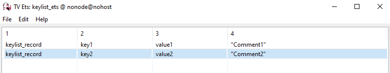
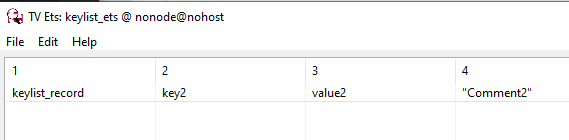

# HW13
# Часть 1 

Использование keylist_mgr в роли таблицы ETS:

```
%% @doc Start keylist_mgr
-spec start() -> {ok, Pid :: pid()} | {error, Reason :: term()}.
start() ->
  gen_server:start_link({local, ?MODULE}, ?MODULE, [], []),
  ets:new(keylist_ets, [set, public, named_table, {keypos, #keylist_record.key}]).
  % Тип выбран Public для того, чтобы возможность добавлять записи
  % Была и у дочених процессов
  ```
Замена lists:... синтаксиса на est:...
```
handle_call({add, Key, Value, Comment}, _From, #state{counter = Counter} = State) ->
  Record = #keylist_record{key = Key, value = Value, comment = Comment},
  ets:insert(keylist_ets, Record),
  NewCounter = Counter + 1,
  NewState = State#state{counter = NewCounter},
  {reply, ok, NewState};

handle_call({is_member, Key}, _From, #state{counter = Counter} = State) ->
  Reply = ets:member(keylist_ets, Key),
  NewState = State#state{counter = Counter},
  {reply, Reply, NewState};

handle_call({take, Key}, _From, #state{counter = Counter} = State) ->
  case ets:lookup(keylist_ets, Key) of
    [] ->
      {reply, not_found, State};

    [Record] ->
      ets:delete(keylist_ets, Key),
      NewCounter = Counter - 1,
      NewState = State#state{counter = NewCounter},
      {reply, Record, NewState}
  end;

handle_call({find, Key}, _From, #state{counter = Counter} = State) ->
  Result = ets:lookup(keylist_ets, Key),
  NewState = State#state{counter = Counter},
  {reply, Result, NewState};

handle_call({delete, Key}, _From, #state{counter = Counter} = State) ->
  ets:delete(keylist_ets, Key),
  NewCounter = Counter - 1,
  NewState = State#state{counter = NewCounter},
  {reply, ok, NewState};
```

# Result

```
18> keylist_mgr:start().
keylist_ets
19> keylist_mgr:start_child(#{name => keylist1, restart => permanent}).
[{keylist1,<0.1082.0>}]
ok
20> keylist:add(keylist1, key1, value1, "Comment1").
ok
21> keylist_mgr:start_child(#{name => keylist2, restart => permanent}).
[{keylist2,<0.1085.0>},{keylist1,<0.1082.0>}]
ok
22> keylist:add(keylist2, key2, value2, "Comment2").
ok
23> observer:start().
```


``` 
24> keylist:is_member(keylist1, key1).
true
25> keylist:find(keylist1, key1).
[{keylist_record,key1,value1,"Comment1"}]
26> keylist:take(keylist1, key1).
{keylist_record,key1,value1,"Comment1"}
27> keylist:delete(keylist1, key1).
ok
```


# Часть 2 

Добавьте в keylist API: match/2, match_object/2, keylist:select/2

```
%% @doc Фильтрует и возвращает данные согласно заданному паттерну
-spec match(Name :: atom(), Pattern :: ets:match_pattern()) -> {ok, list()}.
match(Name, Pattern) ->
  gen_server:call(Name, {match, Pattern}).

%% @doc Фильтрует и возвращает объекты согласно заданному паттерну
-spec match_object(Name :: atom(), Pattern :: ets:match_pattern()) -> {ok, list()}.
match_object(Name, Pattern) ->
  gen_server:call(Name, {match_object, Pattern}).

%% @doc Фильтрует и возвращает данные согласно заданной функции фильтрации
-spec select(Name :: atom(), Filter :: fun()) -> {ok, list()}.
select(Name, Filter) ->
  FilterMs = ets:fun2ms(Filter),
  gen_server:call(Name, {select, FilterMs}).
```

# Result
```
94> keylist:match(keylist1, #keylist_record{key = 'key1', value = '_', comment = '$1'}).
{ok,[[comment1]]}
95> keylist:match_object(keylist1, #keylist_record{key = 'key1', value = '_', comment = '$1'}).
{ok,[#keylist_record{key = key1,value = value1,
                     comment = comment1}]}
103>keylist:select(keylist1, ets:fun2ms(fun(#keylist_record{key = Key, value = Value, comment = Comment}) when Comment =:= comment1 -> [Key, Comment] end)).
{ok,[[key1,comment1]]}
104> keylist:select(keylist1, ets:fun2ms(fun(#keylist_record{key = Key, value = Value, comment = Comment}) when Value =:= value2 -> [Value, Comment] end)).
{ok,[[value2,comment2]]}
105>keylist:select(keylist1, ets:fun2ms(fun(#keylist_record{key = Key, value = Value, comment = Comment}) when Key =:= key1 -> [Value, Comment] end)).
{ok,[[value1,comment1]]}
```

# Задание 3 
```
1> rd(people, {id,name}).
people
2> dets:open_file(folk, [{type, bag}, {file, "folk.dets"}]).
{ok,folk}
3> dets:insert(folk, #people{id=1, name=bob}).
ok
4> dets:insert(folk, #people{id=2, name=mari}).
ok
6> NotBob = ets:fun2ms(fun(#people{id = Id, name = Name}) when Name /= bob -> Id end).
[{#people{id = '$1',name = '$2'},[{'/=','$2',bob}],['$1']}]
7> dets:select(folk, NotBob).
[2]
8> dets:close(folk).
ok
9> dets:select(folk, NotBob). % Не получится так как источник закрыт
** exception error: bad argument
     in function  dets:select/2
        called as dets:select(folk,
                              [{#people{id = '$1',name = '$2'},[{'/=','$2',bob}],['$1']}])
10> dets:open_file(folk, [{type, bag}, {file, "folk.dets"}]).
{ok,folk}
11> exit(self()).
** exception exit: <0.101.0>
12> dets:select(folk, NotBob). % Не получится так как поток, в котором мы открыли файл "завершился".
** exception error: bad argument
     in function  dets:select/2
        called as dets:select(folk,
                              [{#people{id = '$1',name = '$2'},[{'/=','$2',bob}],['$1']}])

```
